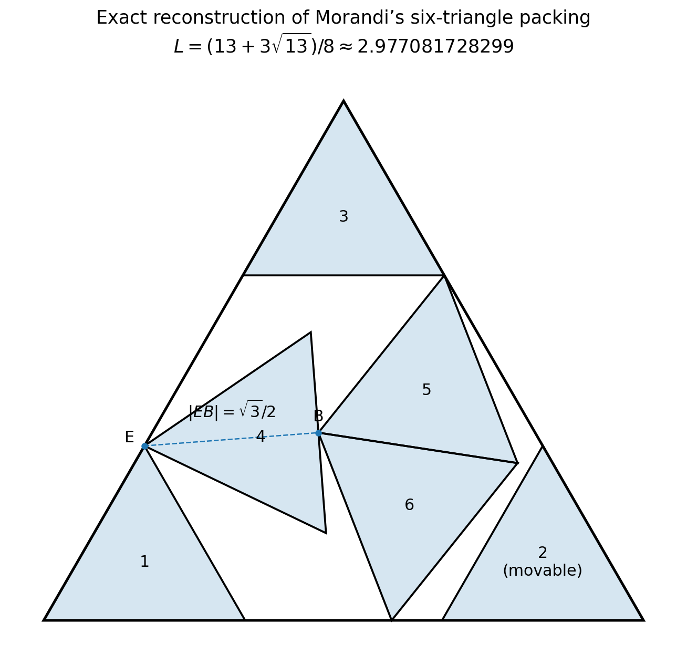

# Optimal packing of six unit equilateral triangles

**Computer-assisted proof, completed 8 October 2026.**

## Theorem

Let six closed equilateral triangles of side 1 have pairwise disjoint interiors,
with arbitrary independent translations and rotations. If they are contained
in an equilateral triangle of side L, then

\[
\boxed{L\ge L_*:=\frac{13+3\sqrt{13}}8
=2.9770817282989959849\ldots.}
\]

Equality is attained by the previously reconstructed Morandi construction.
Moreover, every equality packing contains its same five-piece core, after a
permutation of the pieces and an isometry of the containing triangle. The sixth
piece is not required to occupy a fixed position.

This is a complete **computer-assisted** argument, not a Lean-verified proof or
an independently reviewed publication. The exact finite checks described below
were completed. The mathematical lemmas, checker programs, arithmetic libraries,
compiler/runtime, and ordinary hardware execution form its trust boundary.
No claim of priority in the literature is made.

The accompanying [README](README.md) gives reproduction commands. The actual
finite proof data are the region descriptions and refinement tree, not numerical
optimizer outputs. `ENDPOINT_AUDIT.json` records the completed tree and its checks.



## 1. Exact upper bound and local results

Coordinates (x,z) in this bundle denote physical Cartesian coordinates
(x,sqrt(3)z). The outer triangle is

\[
\Delta_L=\{(x,z):z\ge0,\ x-z\ge0,\ L-x-z\ge0\}.
\]

The program `verify_exact.py` gives exact coordinates in Q(sqrt(13)) for all
six pieces and checks their 18 side lengths, 54 containment inequalities,
counterclockwise orientation, and a separating edge for every pair. It also
checks that the sixth, non-core piece can move through a nonzero interval.
Thus it establishes L_min <= L_star without a numerical tolerance.
The coordinates are reproduced in `RESEARCH.md`.

The core consists of zero-based pieces 0,2,3,4,5 (diagram pieces 1,3,4,5,6).
Two local results will be used:

**Centroid-box theorem.** In the 16 coordinates comprising the five independent
centroid translations, their rotation parameters alpha (physical angle
sqrt(3)alpha), and L-L_star, every feasible displacement d satisfying
||d||_infinity <= 1/300 and L<=L_star equals zero.

**Pivot-tube theorem.** For critical piece 3, replace its centroid translation
by the translation of its vertex E. Let a be its rotation parameter and w the
remaining 15 coordinates. Every feasible placement with L<=L_star and

\[
|a|\le A,\qquad\|w\|_\infty\le W
\]

equals the candidate when (A,W) is any of

\[
(1/60,1/300),\quad(1/40,1/500),\quad(1/25,1/2000).
\]

Neither theorem fixes contacts, fixes the separating-edge choices, or restricts
the sixth triangle. The proofs, including all eight necessary branches and
exact coefficients, are in [LOCAL_PROOF.md](LOCAL_PROOF.md),
[LOCAL_RADIUS.md](LOCAL_RADIUS.md), and [LOCAL_TUBE.md](LOCAL_TUBE.md).
Their exact checks are `verify_local.py`, `verify_local_radius.py`, and
`verify_local_tube.py`. The last program explicitly checks every tube used here;
its selected certificates are in `local_tube_certificate.json`.

The remaining task is global: show that every packing at L_star must enter one
of these local regions. Sections 2–6 establish that fact, using a finite cover
that does not assume any particular contact pattern.

## 2. The rational outer cover and spatial normalization

Use the rational number

\[
U=\frac{29770817283}{10^{10}}=2.9770817283>L_*.
\]

This strict comparison is checked exactly: 8U-13>0 and (8U-13)^2>117.
Let C_L=(L/2,L/6) be the centroid of Delta_L. A packing in Delta_L_star can be
translated by C_U-C_L_star into the concentric copy of that triangle inside
Delta_U. The following cover is constructed for Delta_U. The small difference
between U and L_star is NOT silently ignored; section 5 treats it exactly.

Every small triangle contains its inscribed disk, radius sqrt(3)/6. Its centroid
must therefore be at least that distance from each outer side, and the centroids
of two non-overlapping pieces must be at distance at least 1/sqrt(3).
Set

\[
u=x-z-1/3,\quad v=2z-1/3,\quad D=U-1.
\]

All centroids lie in u>=0, v>=0, u+v<=D. Physical squared distance between
centroids is du^2+du*dv+dv^2, so this is an equilateral triangle of side D.
Divide each side into four equal parts, giving 16 closed triangular cells.
Their diameter D/4 satisfies 3(D/4)^2<1. Consequently, two centroids cannot
belong to the same cell. Choosing any incident cell for a boundary centroid
causes no gap: a collision of chosen cells would violate the same strict bound.

Every packing occupies six distinct coarse cells. There are binomial(16,6)=8008
raw occupancy sets. The six permutations of barycentric coordinates are
isometries of the outer equilateral triangle and partition these sets into
1396 classes. `independent_cases()` in `verify_spatial_refinement.py` constructs
this finite symmetry reduction independently of the graph generator.

After applying a suitable outer-triangle symmetry, any hypothetical packing
belongs to one of these 1396 cases. The initial graph covers every such case.
Nothing here assumes an occupied corner, a shared small-triangle edge, a rhombus,
or the candidate's contact graph.

## 3. Continuous position and orientation regions

A centered upright small triangle is

\[
T=\operatorname{conv}\{(-1/2,-1/6),(1/2,-1/6),(0,1/3)\}.
\]

Orientations are taken modulo 120 degrees. Parameterize theta in [-pi/3,pi/3]
by t=tan(theta/2)/sqrt(3) in [-1/3,1/3], so

\[
R_t=\begin{pmatrix}c(t)&-3w(t)\\w(t)&c(t)\end{pmatrix},\quad
c(t)=\frac{1-3t^2}{1+3t^2},\quad w(t)=\frac{2t}{1+3t^2}.
\]

Every rotation is represented. For even integer K, the closed rational bins are
I_b=[(2b-K)/(3K),(2b+2-K)/(3K)], b=0,...,K-1. Shared endpoints are retained.
Let

\[
a(t)=\frac{1-3t^2+6|t|}{1+3t^2}.
\]

The support values of the rotated triangle in the three outer-normal directions
give the exact containment conditions

\[
z\ge a(t)/6,\qquad x-z\ge a(t)/3,\qquad U-x-z\ge a(t)/3.
\]

The function a is even, with derivative 6(1+t)(1-3t)/(1+3t^2)^2 on [0,1/3].
Its minimum on a bin is therefore its value at the endpoint nearest zero, or
1 if the bin contains zero. Writing delta=(a_min-1)/3 yields the necessary
centroid domain u>=delta, v>=delta, u+v<=D-delta.

An m-by-m triangular subdivision gives m^2 closed fine spatial cells. Intersect
each cell with that necessary centroid domain. A nonempty intersection P,
together with its angle bin, is a **continuous placement region**. Lines and
points are retained. A region may contain artificial possibilities that do not
correspond to a contained unit triangle; retaining them only weakens exclusion.

For a bin midpoint s, let q=(t-s)/(1+3ts) be the relative half-angle parameter.
The maximum of a(q) occurs at one of the two bin endpoints. Define

\[
k_b=1/\max\{a(q(t_-,s)),a(q(t_+,s))\},\quad V_b=k_bR_sT.
\]

The three supporting inequalities of T show V_b is contained in R_tT for EVERY
t in that bin. All checked relative angles lie within 60 degrees, where the
stated endpoint maximum is valid. Thus the fixed rational triangle V_b is an
inner triangle common to every orientation represented by the region.

Refinements may subdivide space into its four closed midsegment children,
subdivide angle into its two closed half-bins, do both, or do neither. The choice
is made independently for each retained parent region. This permits leaving
rattler regions coarse; it is a conservative scheduling choice, not an assumption
that a given piece is free in every possible packing.

The checker reconstructs every required nonempty child intersection. Every
ACTUALLY CONTAINED triangle represented by a parent has a child: the spatial and
angular partitions cover it, and its true support factor is at least the child
bin minimum. Artificial parent possibilities may be removed by those stronger
necessary containment inequalities. No discretization replaces positions or
rotations by samples.

## 4. Exact conservative compatibility graphs

If two translated inner triangles have disjoint interiors, one of their six
directed edge normals separates them. For an owner edge p->q, take the outward
covector n=(q_z-p_z,p_x-q_x). If the other triangle is on its exterior side,

\[
n\cdot(c_j-c_i)\ge h_{V_i}(n)+h_{V_j}(-n),
\]

where h denotes the maximum vertex projection. This separating-axis criterion
follows by applying the supporting half-planes of the Minkowski difference of
the two triangles. It allows boundary contact.

For the two rational centroid polygons P_i,P_j, the largest possible left side
is max_{P_j} n.c - min_{P_i} n.c. Store directed integer bounds, with S=2^36,

\[
\ell_{i,n}\le S\min_{P_i}n.c,\quad
U_{j,n}\ge S\max_{P_j}n.c,\quad
H_{n,b_j}\le S(h_{V_i}(n)+h_{V_j}(-n)).
\]

If U_{j,n}-ell_{i,n}-H_{n,b_j}<0 for all six choices, separation is impossible
throughout the two regions, so they are incompatible. Otherwise the graph edge
is retained. Regions in the same coarse cell are incompatible by section 2.
Every true packing therefore yields a six-vertex clique, one vertex per occupied
coarse cell. A graph clique is not asserted to be a true packing.

The fast generator uses floating point ONLY to propose padded integer bounds.
There is no assumed roundoff tolerance in proof acceptance. The independent
geometry checker reconstructs every polygon using rational intersections of
bounding lines, reconstructs the exact rational inner triangles, and checks all
bounds by arbitrary-precision integer cross-multiplication. The separate graph
checker checks every missing edge against these accepted bounds. Uncertain pairs
remain edges. Checked magnitude limits make the subsequent signed 64-bit sums
and differences exact without overflow.

Only the angle bins that occur in a graph are stored. The independently checked
index map includes every bin used by a region. Compression loses no orientation.

## 5. Whole-region local labels, with exact centering

For any of the six container isometries, let M be its inverse linear part about
the centroid. A centroid polygon P in the U-cover is compared with the candidate
using

\[
\boxed{p\longmapsto M(p-C_U)+C_{L_*}.}
\]

The coefficients of M are rational in scaled coordinates. Candidate coordinates
are in Q(sqrt(13)); all position comparisons are exact in that field. Crucially,
this maps the embedded Delta_L_star back to Delta_L_star, NOT to Delta_U.
The local theorem is consequently applied at L=L_star. It is not incorrectly
applied to a configuration whose containing side is U>L_star.

For a centroid-box label, every vertex of the transformed centroid polygon must
satisfy the specified coordinate bounds. For angles, reflection changes t to -t;
120-degree rotations leave the shape's orientation unchanged modulo its symmetry.
If t_0 is the candidate orientation, the relative parameter
q=(t-t_0)/(1+3tt_0) is monotone on a bin. Its denominator is positive. The bound
|q|<=r/2 at both endpoints implies throughout the interval

\[
|\alpha|=\left|\frac2{\sqrt3}\arctan(\sqrt3q)\right|\le2|q|\le r.
\]

The pivot-tube labels require the same centroid and angle bounds W for the four
noncritical pieces. For critical piece 3 they require angle bound A and bounds W
on the coordinates of its vertex E. The canonical critical orientation maps
upright vertex (-1/2,-1/6) to E minus its centroid; this identity is checked exactly.
Thus E's possible position is obtained by adding the rotating vertex offset to
the centroid polygon.

That offset is bounded over the entire angle interval, not just at the endpoints.
If f is either scaled coordinate of the offset as a function of t, then
|f''(t)|<12 on [-1/3,1/3]: the circumradius is 1/sqrt(3),
|theta'|<=2sqrt(3), and |theta''|<=4sqrt(3), giving the bound
4sqrt(3)+4<11 for the physical coordinate (and no larger for z).
Linear interpolation therefore has error at most (3/2)(t_+-t_-)^2.
Exact endpoint values enlarged by that error enclose the whole offset range.
Combining it with the transformed polygon encloses every possible E position.

Each certificate has five labels, one for each distinct core piece. A label is
attached only if its entire region satisfies that piece's local bounds. A clique
is locally covered when its vertices supply all five labels of ONE common local
theorem and ONE common container isometry. There are six centroid-box channels
and eighteen pivot-tube channels. Labels from different tubes are NEVER mixed
to assemble a claimed core. The independent label checker verifies every positive
label with exact inequalities and separately reconstructed polygons.

For a true packing at L_star, a locally covered clique implies by section 1 that
its five labeled pieces are exactly the candidate core. Relabeling is legitimate:
each vertex label names a distinct core piece, and the clique supplies five
such pieces. The unlabelled sixth triangle remains unrestricted.

## 6. Exhaustive elimination of the uncovered possibilities

A graph node in the proof tree has a declared list of active coarse occupancy
cases. The root list is all 1396 cases. A case supplies six graph-vertex domains,
one per occupied coarse cell. The independent exhaustive checker uses only the
following sound operations.

1. **Arc consistency.** A vertex without a neighbor in some other domain cannot
   belong to a simultaneous selection. Delete it. An empty domain excludes the
   case.
2. **Exhaustive vertex branching.** Choose a domain, try each vertex, and intersect
   all remaining domains with its neighbors. This covers every clique.
3. **Local coverage.** If the chosen vertices together with labels common to all
   possibilities in the remaining domains supply a full core for one certificate,
   every completion is already handled by its local theorem.
4. **Local-omission branching.** An uncovered clique must omit at least one of the
   five labels of any fixed local certificate. For each label not already supplied
   by the chosen vertices, delete every vertex with that label from ALL remaining
   domains and search the resulting case. This disjunction covers every uncovered
   clique. It never combines the coordinates of different local theorems.

The last operation makes the endpoint tractable: the search does not waste time
enumerating all already-covered placements of the movable triangle. The C++
searcher is exploratory; its statuses and time limits are not accepted as proof.
The independent Python integer-bitset verifier performs its own exhaustive
searches with no timeout acceptance.

Before a refinement, the generator declares allowed parent regions. For each
omitted parent vertex, the independent verifier fixes that vertex and refutes
all uncovered cliques extending it. These omissions can be checked successively:
each prior deletion has already been shown to remove no uncovered possibility.
Some earlier stages used only ordinary clique or arc-consistency refutations,
which are weaker but also sound. Extra retained vertices and exploratory timeouts
are harmless.

The child case lists partition the parent's unclosed active cases. Their spatial
and angular children are checked as in section 3. Thus any unclassified true
packing in a parent case gives an uncovered clique in its assigned child case.
The implication continues down the finite tree. All leaf cases have been checked
to contain no uncovered clique. A true packing without the candidate core would
therefore descend to an impossible leaf. This proves:

> Every six-triangle packing in Delta_L_star contains the exact candidate
> five-piece core, up to a permutation and an outer-triangle isometry.

The final structural audit verifies that every declared node is reached exactly
once from the root, no unproved frontier remains, the child case lists are
disjoint and complete for their transfers, all checked input hashes match,
and the numbers of cases closed sum to 1396. This is not an assumption that
numerical searches found all relevant packing types.

## 7. The exact lower bound, not a decimal approximation

Suppose a packing existed at a side l<L_star. Translate it by C_L_star-C_l.
For every vertex, the three defining margins in Delta_L_star exceed the margins
in Delta_l by, respectively,

\[
(L_*-l)/6,\qquad (L_*-l)/3,\qquad (L_*-l)/3.
\]

They are therefore all strictly positive. This gives a packing at L_star with
no vertex on its boundary. But section 6 forces that packing to contain an
isometric copy of the exact core. The core has vertices on the outer boundary,
as do all its outer-triangle symmetries. Contradiction.

Thus no l<L_star is feasible. Section 1 supplies feasibility at L_star itself.
This proves the stated exact optimum. Compactness or an unproved limiting
argument is not needed to close the last decimal gap.

## 8. Completed finite checks

The completed endpoint tree has **108 graphs** and **1,948,929 placement regions**,
summed over levels (overlapping or repeated regions are counted again).
It represents all 8008 raw occupancy patterns through 1396 verified symmetry
classes. It checks **207,880 fixed-vertex refutations** used in the transfers.

The independent geometry checks verify **3,027,404,412 coordinate bounds** and
**17,457,330 separating thresholds**. The integer graph checks verify
**16,490,667,855 missing pairs**. These are sums over graphs, not claims that all
checked geometric inequalities are distinct. The final 28,007-region graph is
closed by the independent search in seven recursive calls, using three local-
omission splits. The earlier global work is essential to reach that small endgame.

`ENDPOINT_AUDIT.json` records the tree, counts, and input hashes. Per-graph files
ending `_geometry_check.json` and `_node_check.json` record the separate checks.
`ENDPOINT_POSITIVE_CONTROLS.json` follows the known construction and two nonzero
rattler translations through the actual tree until a valid local stopping rule
applies. `ENDPOINT_NEGATIVE_CONTROLS.json` records rejection of missing child
regions, a missing orientation index, a nonconservative bound, a removed valid
compatibility edge, and a false local label. Regression tests additionally compare
both graph-search implementations against brute force on small graphs, including
multiple local certificates. Tests supplement, not replace, the exhaustive proof.

The full data and all checks were completed in the working run. Clean-release
rebuild controls are recorded separately in `RELEASE_REBUILD_CHECKS.json`; those
are not described as a second fresh reconstruction of every graph.

## 9. Reproduction and trust boundary

From the extracted standalone directory, with Python, NumPy, Numba, a C++17
compiler, and Boost.Multiprecision headers available:

```sh
python -m pip install -r requirements-endpoint.txt
python run_endpoint_checks.py
```

This recomputes the exact construction and local certificates, rebuilds each
large graph from the compact region descriptions, performs its independent
rational and integer checks, verifies its exhaustive case transfers/closures,
and audits the complete tree. It does NOT accept stored success messages as the
arithmetic proof. Disposable large data are removed by default after checking.
Do not use Python's `-O` option: assertions are part of verification.

`audit_endpoint.py` alone checks recorded transcripts, tree structure, and hashes;
it is not a rerun of the underlying arithmetic. `run_endpoint_checks.py --node
PREFIX` checks only a selected graph and is explicitly not the complete theorem.

The proof is not yet formalized in Lean. Its trusted components are the written
analytic/geometric lemmas; the separately implemented checker programs; exact
Python integer/Fraction and Q(sqrt(13)) arithmetic; NumPy's lossless array/bit
operations; Boost.Multiprecision and the integer C++ checker; the compiler,
runtime, and ordinary execution hardware. The floating-point generator and the
exploratory C++ searches are not trusted for exclusions. Independent external
review remains appropriate before treating this as a published mathematical result.
